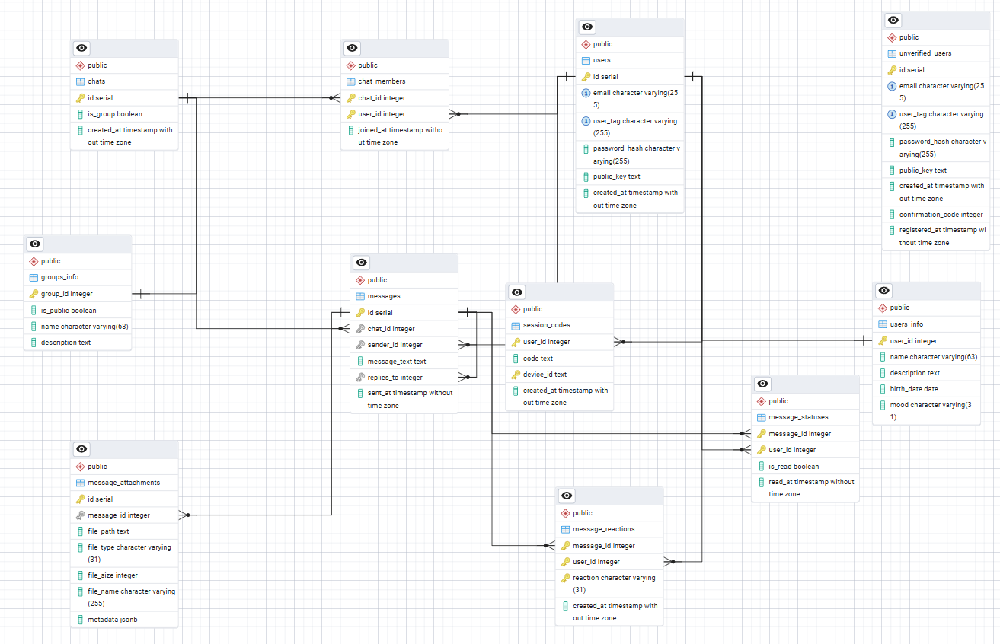

# Listen | C++ & Qt Messenger

Listen - a fully functional cross-platform desktop messenger built with C++ and Qt, containerized via Docker.  
Key advantage over other messengers for users is end-to-end encryption. Messages can only be read by users and no one else.

The project is organized as monorepository with 3 key folders: 'database', 'client' and 'server'.

## *Main tasks*

* [ ] Functional main server with SSL for login/registration and saving data to DB
* [ ] Email verification server
* [ ] Update main server for email verification
* [ ] Client part with base GUI for login/registration
* [ ] Simple message sending between users
* [ ] Encrypted message forwarding
* [X] Connection pool

### *Features*

---

* [ ] Session tokens
* [ ] Multi-device capability
* [ ] Groups and private chats
* [ ] Advanced interaction with messages (pinning, forwarding or replying)
* [ ] Send/Read statuses
* [ ] Reactions to messages
* [ ] File and voice messages sending
* [ ] Audio calls

### *Future tasks*

---

* [ ] ARM systems support
* [ ] Admin Dashboard
* [ ] Application website

## *Database details*

In this project we are using relational database by **PostgreSQL** for everything. DB tables meet the conditions of the **3NF** and **BCNF**, so they are designed efficiently enough for use in our system.

For more details about *Normal Forms* click here [Proving 1NF - 3NF](./database/normalization.md)

### Database Schema

### Run instruction

> [!NOTE]
> The project is currently under active development. Comprehensive instructions on how to build the Qt client and spin up the Docker-compose environment for the server will be available in the upcoming releases.
